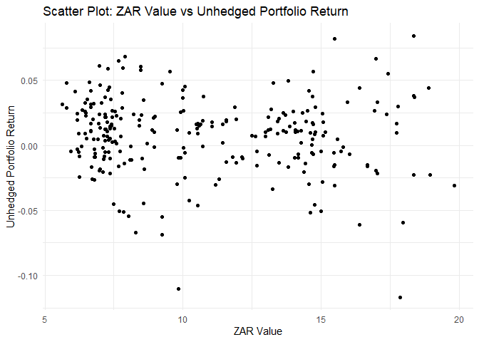

# Purpose

This is the final README, it is a compilation of questions one through
seven.

``` r
rm(list = ls()) # Clean your environment:
gc() # garbage collection - It can be useful to call gc after a large object has been removed, as this may prompt R to return memory to the operating system.
```

    ##          used (Mb) gc trigger (Mb) max used (Mb)
    ## Ncells 468991 25.1    1009781   54   660385 35.3
    ## Vcells 875330  6.7    8388608   64  1769630 13.6

``` r
library(tidyverse)
```

    ## ── Attaching core tidyverse packages ──────────────────────── tidyverse 2.0.0 ──
    ## ✔ dplyr     1.1.3     ✔ readr     2.1.4
    ## ✔ forcats   1.0.0     ✔ stringr   1.5.0
    ## ✔ ggplot2   3.4.4     ✔ tibble    3.2.1
    ## ✔ lubridate 1.9.3     ✔ tidyr     1.3.0
    ## ✔ purrr     1.0.2     
    ## ── Conflicts ────────────────────────────────────────── tidyverse_conflicts() ──
    ## ✖ dplyr::filter() masks stats::filter()
    ## ✖ dplyr::lag()    masks stats::lag()
    ## ℹ Use the conflicted package (<http://conflicted.r-lib.org/>) to force all conflicts to become errors

``` r
list.files('code/', full.names = T, recursive = T) %>% .[grepl('.R', .)] %>% as.list() %>% walk(~source(.))
```

``` r
#Loading all relevant packages. 
#install.packages("pacman")
pacman::p_load(tidyverse)
pacman::p_load(readxl)
pacman::p_load(readr)
pacman::p_load(ggplot2)
pacman::p_load(gt)
pacman::p_load(dplyr)
library(gt)
library(tidyverse)
library(dplyr)
library(lubridate)
library(zoo)
library(tidyr)
library(tseries)
library(PortfolioAnalytics)
library(ggplot2)
library(RcppRoll)
library(tbl2xts)
library(fmxdat)
library(rmsfuns)
```

``` r
#Loading all relevant code from each questions code folder. 
list.files('C:/Users/austi/OneDrive/Desktop/Masters/Financial Econometrics/22582053 (Fin_metrics)/Question 1/code', full.names = T, recursive = T) %>% as.list() %>% walk(~source(.))
list.files('C:/Users/austi/OneDrive/Desktop/Masters/Financial Econometrics/22582053 (Fin_metrics)/Question 2/code', full.names = T, recursive = T) %>% as.list() %>% walk(~source(.))
list.files('C:/Users/austi/OneDrive/Desktop/Masters/Financial Econometrics/22582053 (Fin_metrics)/Question 3/code', full.names = T, recursive = T) %>% as.list() %>% walk(~source(.))
list.files('C:/Users/austi/OneDrive/Desktop/Masters/Financial Econometrics/22582053 (Fin_metrics)/Question 4/code', full.names = T, recursive = T) %>% as.list() %>% walk(~source(.))
list.files('C:/Users/austi/OneDrive/Desktop/Masters/Financial Econometrics/22582053 (Fin_metrics)/Question 5/code', full.names = T, recursive = T) %>% as.list() %>% walk(~source(.))
list.files('C:/Users/austi/OneDrive/Desktop/Masters/Financial Econometrics/22582053 (Fin_metrics)/Question 6/code', full.names = T, recursive = T) %>% as.list() %>% walk(~source(.))
list.files('C:/Users/austi/OneDrive/Desktop/Masters/Financial Econometrics/22582053 (Fin_metrics)/Question 7/code', full.names = T, recursive = T) %>% as.list() %>% walk(~source(.))
```

# Question 1: Systematic AI fund

``` r
#Loading relevant data for question 1
library(tidyverse)
ASISA <- readRDS("C:/Users/austi/OneDrive/Desktop/Masters/Financial Econometrics/22582053 (Fin_metrics)/data/ASISA_Rets.rds") #The ASISA fund data starts on 2003-10-31 and ends 2023-09-30

BM <- readRDS("C:/Users/austi/OneDrive/Desktop/Masters/Financial Econometrics/22582053 (Fin_metrics)/data/Capped_SWIX.rds")#The BM data starts on 2002-02-28 and ends 2023-09-30

AI_Fund <- readRDS("C:/Users/austi/OneDrive/Desktop/Masters/Financial Econometrics/22582053 (Fin_metrics)/data/AI_Max_Fund.rds")#The AI_Fund data starts on 2003-01-31 and ends 2023-09-30 

#All the data ends on the same date but starts on different dates. I need to keep this in mind find plotting comparative plots. 
```

## Rolling returns camparison

``` r
#First loading the relevant packages 
pacman::p_load("xts", "tidyverse", "tbl2xts", "PerformanceAnalytics", 
    "lubridate", "glue", "RcppRoll", "fmxdat")

#Now I need to merge the ASISA, BM and AI_fund datasets to ensure comparative analysis is easier. 

# Renaming columns for ease
names(AI_Fund)[2] <- "AI_Fund_Return"
names(BM)[3] <- "BM_Return"

# Merging AI Fund and Benchmark Data
combined_returns_data <- left_join(AI_Fund, BM, by = "date")

# Aggregate ASISA Data
ASISA_aggregated <- ASISA %>%
  group_by(date) %>%
  summarize(ASISA_Return = mean(Returns))

# Merge with ASISA Data
final_merged_returns_data <- left_join(combined_returns_data, ASISA_aggregated, by = "date")

# Checking the final merged data
head(final_merged_returns_data)
```

    ## # A tibble: 6 × 5
    ##   date       AI_Fund_Return Tickers BM_Return ASISA_Return
    ##   <date>              <dbl> <chr>       <dbl>        <dbl>
    ## 1 2003-01-31       -0.0275  J433    -0.0372             NA
    ## 2 2003-02-28       -0.0427  J433    -0.0455             NA
    ## 3 2003-03-31       -0.0945  J433    -0.0828             NA
    ## 4 2003-04-30       -0.00903 J433    -0.000818           NA
    ## 5 2003-05-31        0.131   J433     0.127              NA
    ## 6 2003-06-30        0.00995 J433    -0.00341            NA

``` r
#Now I can start calculating the rolling returns

# Prepare the data
Rolling_returns_plot_df <- final_merged_returns_data %>%
  mutate(Rolling_Return_AI_Fund = RcppRoll::roll_mean(AI_Fund_Return, 12, fill = NA, align = "right"),
         Rolling_Return_BM = RcppRoll::roll_mean(BM_Return, 12, fill = NA, align = "right"),
         Rolling_Return_ASISA = RcppRoll::roll_mean(ASISA_Return, 12, fill = NA, align = "right")) %>%
  group_by(date) %>% 
  filter(any(!is.na(Rolling_Return_AI_Fund) | !is.na(Rolling_Return_BM) | !is.na(Rolling_Return_ASISA)))

# Create the plot
Rolling_returns_plot <- Rolling_returns_plot_df %>%
  ggplot() +
  geom_line(aes(date, Rolling_Return_AI_Fund, color = "AI Fund"), alpha = 0.7, size = 1.25) +
  geom_line(aes(date, Rolling_Return_BM, color = "Benchmark"), alpha = 0.7, size = 1.25) +
  geom_line(aes(date, Rolling_Return_ASISA, color = "ASISA"), alpha = 0.7, size = 1.25) +
  labs(title = "Rolling Returns: AI Fund vs Benchmark vs ASISA", x = "", y = "Rolling Return", caption = "Note: Rolling returns calculated over 12 months.") +
  fmxdat::theme_fmx(title.size = ggpts(30), subtitle.size = ggpts(5), caption.size = fmxdat::ggpts(25), CustomCaption = T) +
  fmx_cols()
```

    ## Warning: Using `size` aesthetic for lines was deprecated in ggplot2 3.4.0.
    ## ℹ Please use `linewidth` instead.
    ## This warning is displayed once every 8 hours.
    ## Call `lifecycle::last_lifecycle_warnings()` to see where this warning was
    ## generated.

``` r
# Apply finplot
finplot(Rolling_returns_plot, x.date.dist = "1 year", x.date.type = "%Y", x.vert = T, y.pct = T, y.pct_acc = 1)
```

    ## Warning: Removed 9 rows containing missing values (`geom_line()`).

 \##
Histogram plot for comarison of funds

``` r
histogram_plot <- create_histogram_plot_fund_vs_benchmark(final_merged_returns_data, c("AI_Fund_Return", "BM_Return", "ASISA_Return"))
```

    ## Warning: Using an external vector in selections was deprecated in tidyselect 1.1.0.
    ## ℹ Please use `all_of()` or `any_of()` instead.
    ##   # Was:
    ##   data %>% select(fund_columns)
    ## 
    ##   # Now:
    ##   data %>% select(all_of(fund_columns))
    ## 
    ## See <https://tidyselect.r-lib.org/reference/faq-external-vector.html>.
    ## This warning is displayed once every 8 hours.
    ## Call `lifecycle::last_lifecycle_warnings()` to see where this warning was
    ## generated.

``` r
print(histogram_plot)
```

    ## Warning: Removed 9 rows containing non-finite values (`stat_bin()`).


## Making use of the PerformanceAnalytics package to do inference on the ASISA, BM and AI_Fund

``` r
#Dropping the Tickets column from the dataset

final_merged_returns_data <- select(final_merged_returns_data, -Tickers)

#Transforming to xts

xts_final_merged_returns_data <-final_merged_returns_data %>% 
    gather(funds, returns, -date) %>% 
    group_by(funds) %>% 
    tbl_xts(tblData = ., cols_to_xts = returns, spread_by = funds)
```

### Some intresting stats

``` r
#Now that the merged returns data is in xts I can do some nice analysis 

#Calculate annualized returns for each dataset
ai_fund_stats <- table.AnnualizedReturns(xts_final_merged_returns_data$AI_Fund_Return, scale = 252)
bm_stats <- table.AnnualizedReturns(xts_final_merged_returns_data$BM_Return, scale = 252)
asisa_stats <- table.AnnualizedReturns(xts_final_merged_returns_data$ASISA_Return, scale = 252)

# Convert to data frames and add a fund identifier
df_ai_fund <- as.data.frame(t(ai_fund_stats)) %>% mutate(Fund = "AI Fund")
df_bm <- as.data.frame(t(bm_stats)) %>% mutate(Fund = "BM")
df_asisa <- as.data.frame(t(asisa_stats)) %>% mutate(Fund = "ASISA")

# Combine the data frames
combined_stats <- bind_rows(df_ai_fund, df_bm, df_asisa)

# Optional: rearrange columns so that 'Fund' is the first column
combined_stats <- combined_stats %>% select(Fund, everything())

# View the combined table
print(combined_stats)
```

    ##                   Fund Annualized Return Annualized Std Dev
    ## AI_Fund_Return AI Fund           21.0050             0.7260
    ## BM_Return           BM           13.4316             0.6881
    ## ASISA_Return     ASISA            8.1839             0.3296
    ##                Annualized Sharpe (Rf=0%)
    ## AI_Fund_Return                   28.9337
    ## BM_Return                        19.5202
    ## ASISA_Return                     24.8296

My fund = My fund has a very high annual return of 21% which is higher
than both the benchmark capped SWIX and the actively managed ASISA. My
fund also has an extremely low standard deviation of 0.726% which means
that my fund holds very little risk. Furthermore, the Sharpe ratio of
28.9 is extraordinarily high.

The benchmark fund = The benchmark fund has very decent annual returns
of 14.43%. Furthermore the benchmark as expected has a low annualized
standard deviation of 0.69%. Thus, meaning the benchmark holds very
little risk. Once again, the Sharpe ration of 19.52 is extraordinarily
high.

The active managers = The actice managers have on average an annualized
return of 8.1%, this is fairly good but is lagging behind my fund at 21%
and the benchmark at 14.43%.

# Question 2

# Question 3: Portfolio construction

## Loading relevant data and packages and calling in fucntions

``` r
#Relevant data
ALSI <- readRDS("C:/Users/austi/OneDrive/Desktop/Masters/Financial Econometrics/22582053 (Fin_metrics)/data/ALSI.rds")

Rebalance_days <- readRDS("C:/Users/austi/OneDrive/Desktop/Masters/Financial Econometrics/22582053 (Fin_metrics)/data/Rebalance_days.rds")

#relevant packages
library(rmsfuns)
pacman::p_load("tidyr", "tbl2xts","devtools","lubridate", "readr", "PerformanceAnalytics", "ggplot2", "dplyr")

#Calling in functions
library(tidyverse)
list.files('C:/Users/austi/OneDrive/Desktop/Masters/Financial Econometrics/22582053 (Fin_metrics)/Question 3/code', full.names = T, recursive = T) %>% as.list() %>% walk(~source(.))
```

## Introduction

Using the information on the ALSI (J203) and SWIX (J403) Indexes, I will
be writing a short report where I will be comparing the specific
methodologies used by the ALSI and the SWIX, evaluating the cumulative
returns of each and plotting them together to perform a comparisson,
evaluating which sectors hold the highest weight and contribution for
each.

## Lets create an ALSI and SWIX weighted poerfolio cumulative returns

### First lets calculate each indexes weighted daily portfolio returns using the safe_returns:

In order to use the safe_returns function to calculate the weighted
portfolio returns I need to convert the data to and xts format. That is
done below:

``` r
#Transforming the data to xts format so we can use safe_returns
ALSI_weights_xts <- ALSI %>% 
    select(date, Tickers, J203) %>% 
    tbl_xts(cols_to_xts = J203, spread_by = Tickers)

SWIX_weights_xts <- ALSI %>% 
    select(date, Tickers, J403) %>% 
    tbl_xts(cols_to_xts = J403, spread_by = Tickers)

Returns_xts <- ALSI %>% 
    select(date, Tickers, Return) %>% 
    tbl_xts(cols_to_xts = Return, spread_by = Tickers)

#Making sure that all NA's are set to 0 

ALSI_weights_xts[is.na(ALSI_weights_xts)] <- 0
SWIX_weights_xts[is.na(SWIX_weights_xts)] <- 0
Returns_xts[is.na(Returns_xts)] <- 0

#Now using the safe returns I calculate the weighted portfolio returns for the ALSI. 
ALSI_port_returns <- rmsfuns::Safe_Return.portfolio(R = Returns_xts, weights = ALSI_weights_xts, lag_weights = T) %>%  
    xts_tbl() %>%  rename(ALSI_port_returns = portfolio.returns)
```

    ## Warning in Return.portfolio.geometric(R = R, weights = weights, wealth.index =
    ## wealth.index, : The weights for one or more periods do not sum up to 1:
    ## assuming a return of 0 for the residual weights

``` r
#Now using the safe returns I calculate the weighted portfolio returns for the SWIX.
SWIX_port_returns <- rmsfuns::Safe_Return.portfolio(R = Returns_xts, weights = SWIX_weights_xts, lag_weights = T) %>%  
    xts_tbl() %>%  rename(SWIX_port_returns = portfolio.returns)
```

    ## Warning in Return.portfolio.geometric(R = R, weights = weights, wealth.index =
    ## wealth.index, : The weights for one or more periods do not sum up to 1:
    ## assuming a return of 0 for the residual weights

``` r
#Merging the ALSI and SWIX weighted portfolio returns
returns_port_merged <- left_join(ALSI_port_returns, SWIX_port_returns, by= "date")
#We now have a merged data frame that contains the returns for the weighted ALSI and SWIX portfolios. From here we can do some cool analysis. Which will be done now. 
```

Now that we have the merged data frame of portfolio returns for the ALSI
and SWIX in the correct format, I can move onto calculating the
cumulative weighted returns.

``` r
#Now i need to calculate the cumulative returns. Calculating the cumulative returns for each weighted portfolio will  provide a good base to do meaningful comparison.  


cumulative_returns_port <- returns_port_merged %>%  arrange(date) %>% 
    
    mutate(across(.cols = -date, .fns = ~cumprod(1 + .))) %>% 
    
    mutate(across(.cols = -date, .fns = ~./first(.))) %>% 
    # Start at 1
    
    pivot_longer(cols=-date, names_to = "Index", values_to = "Cummulative_port_returns")


cumulative_returns_port_plot <-    cumulative_returns_port %>%  
       
       ggplot() + 
  
  geom_line(aes(date, Cummulative_port_returns , color = Index), size = 0.5, alpha = 0.8) +
  
   fmxdat::theme_fmx(title.size = fmxdat::ggpts(25), 
                    subtitle.size = fmxdat::ggpts(0),
                    caption.size = fmxdat::ggpts(20),
                    CustomCaption = T) + 
    
  fmxdat::fmx_cols() + 
  
  labs(x = "", y = "Percentage(%)", caption = "Note:\nCalculation own",
       title = "Cumulative Returns of ALSI and SWIX Indexes",
       subtitle = "")

# Finplot for finishing touches:

fmxdat::finplot(cumulative_returns_port_plot, x.vert = T, x.date.type = "%Y", x.date.dist = "1 year")
```


As can be seen from the above graph, the cumulative returns for the ALSI
and the SWIX were very similar until 2020, at which point the ALSI began
outperforming the SWIX. Immediate prior to this separation in cumulative
returns was a huge draw down for both the ALSI and SWIX weighted
portfolios. Since this draw down is within 2020, a possible reason could
be the COVID-19 pandemic. There may have been a switch in weights
between the two portfolios which would result in varying returns. From
the graph it is evident that the ALSI reacted better than the SWIX to
this heavy draw down in 2020.

To further this analysis I will dive into the weighted construction of
the ALSI and SWIX portfolios, more precisely, I will be analyzing the
weighted return contribution for each sector and evaluating the
differences in the ALSI and SWIX.

#### Each sectors weighted return contribution

In this section of code I am grouping by sector to then be able to
calculate the weighted reuturn contribution of each sector in the
respective ALSI and SWIX portfolios. I can then evaluate which sectors
are the main drivers to portfolio returns.

``` r
#Creating a data frame that contains weighted portfolio returns for the ALSI and SWIX
portfolio_returns <- ALSI %>% 
    mutate(J203 = coalesce(J203,0)) %>% 
    mutate(J403 = coalesce(J403,0)) %>% 
    mutate(weighted_ALSI_ret = Return*J203) %>% 
    mutate(weighted_SWIX_ret = Return*J403)

#In this section of code I am grouping by sector to then be able to calculate the weighted reuturn contribution of each sector in the respective ALSI and SWIX portfolios. I can then evaluate which sectors are the main drivers to portfolio returns. 
portfolio_returns_with_total_sector_weights<-portfolio_returns %>% 
    arrange(date) %>% 
    group_by(date,Sector) %>% 
    mutate(ALSI_sector_weight = coalesce(J203,0)) %>% 
    mutate(SWIX_sector_weight = coalesce(J403,0)) %>% 
    mutate(ALSI_sector_returns = sum(weighted_ALSI_ret,na.rm = T)) %>% 
    mutate(total_ALSI_sector_weight = sum(J203, na.rm=T)) %>% 
    mutate(SWIX_sector_returns = sum(weighted_SWIX_ret, na.rm = T)) %>% 
    mutate(total_SWIX_sector_weight = sum(J403, na.rm=T)) %>% 
    ungroup()

#Transforming the sector weights data to xts to make use of the performance analytics package 
total_ALSI_sector_weight <-  portfolio_returns_with_total_sector_weights %>%  select(date, Sector ,total_ALSI_sector_weight) %>%  group_by(Sector) %>%  unique() %>%  
    tbl_xts(cols_to_xts = total_ALSI_sector_weight, spread_by = Sector)

total_SWIX_sector_weight <-  portfolio_returns_with_total_sector_weights %>%  select(date, Sector ,total_SWIX_sector_weight) %>%  group_by(Sector) %>%  unique() %>%  
    tbl_xts(cols_to_xts = total_SWIX_sector_weight, spread_by = Sector)

#Transforming the sectors returns to xts data so that we can make use of the performance analytics package
ALSI_sector_returns <- portfolio_returns_with_total_sector_weights %>%  select(date, Sector ,ALSI_sector_returns) %>%  group_by(Sector) %>%  unique() %>%  
    tbl_xts(cols_to_xts = ALSI_sector_returns, spread_by = Sector)

SWIX_sector_returns <- portfolio_returns_with_total_sector_weights %>%  select(date, Sector ,SWIX_sector_returns) %>%  group_by(Sector) %>%  unique() %>%  
    tbl_xts(cols_to_xts = SWIX_sector_returns, spread_by = Sector)

#Lets make an arbitrary starting amount for our funds. 
Fund_size_at_start <- 1000 #Setting the starting value for the portfolio 

ALSI_sector_return_division <- 
      rmsfuns::Safe_Return.portfolio(ALSI_sector_returns, 
                                     
                       weights = total_ALSI_sector_weight, lag_weights = TRUE,
                       
                       verbose = TRUE, contribution = TRUE, 
                       
                       value = Fund_size_at_start, geometric = TRUE) 
```

    ## Warning in Return.portfolio.geometric(R = R, weights = weights, wealth.index =
    ## wealth.index, : The weights for one or more periods do not sum up to 1:
    ## assuming a return of 0 for the residual weights

``` r
SWIX_sector_return_division <- 
      rmsfuns::Safe_Return.portfolio(SWIX_sector_returns, 
                                     
                       weights = total_SWIX_sector_weight, lag_weights = TRUE,
                       
                       verbose = TRUE, contribution = TRUE, 
                       
                       value = Fund_size_at_start, geometric = TRUE) 
```

    ## Warning in Return.portfolio.geometric(R = R, weights = weights, wealth.index =
    ## wealth.index, : The weights for one or more periods do not sum up to 1:
    ## assuming a return of 0 for the residual weights

#### The ALSI’s individual sectors weighted return contribution

Here we are able to evaluate which sector(s) are the main weighted
return drivers of the ALSI weighted portfolio. From the plot below it is
evident that for the last 10 years the majority of the return in the
ALSI weighted portfolio has come from the Industrial sector and the
lowest coming from the property/residual sectors. However, since 2016
the industrial sector has slowly started lossing its majority hold to an
ever rising contribution from the resources sector.

Next we are going to evaluate the same plot but for the SWIX weighted
portfolio. We will then be able to do identify a possibility of why the
cumulative returns of the two portfolios differ.

``` r
#Lets now plot
 ALSI_sector_return_division$BOP.Weight  %>% .[endpoints(.,'months')] %>% chart.StackedBar()
```

 \####
The SWIX’s individual sectors weighted return contribution

The plot below evaluates which sector(s) are the main weighted return
drivers of the SWIX weighted portfolio. Like that of the ALSI, the
majority holding is found in the industrial sector with again the
minority held by the the property/residual sectors. The trajectory of
increased contribution from the resources sector is scene here again as
was seen in the ALSI portfolio. However, the differences lie in the
actual value. It is evident that the SWIX weighted portfolio has a more
even contribution between the financial sector and resources sector.
Where the ALSI has a higher contribution from the resources sector over
the financial sector.

``` r
#Lets now plot
 SWIX_sector_return_division$BOP.Weight  %>% .[endpoints(.,'months')] %>% chart.StackedBar()
```

 \####
Comparisson of the ALSI and SWIX portfolio contribution

When evaluating the weighted contributions of the various sectors to the
ALSI and SWIX portfolios, there are some similarities but also some
points of difference. Both portfolios have a large contribution from the
industrial sector. Where the differences play a part is with respect to
the financial a resources sectors. The ALSI obtains more weight from the
resource sectors over that of the financial sector, while the SWIX
obtains more of an even split between the two. This difference may be
the contributing factor as to why the ALSI performed better than the
SWIX since 2020.

## 5% capped portfolio

# Question 4

What is needed from me in this question: - Analyze if funds that have
performed well in the past will also perform well in the future. -
Evaluate whether funds that perform well in the past attract more
investors. - Evaluate whether investing in past good performers is a
good strategy.

# Introduction

This question will provide insight into industry fund flows between
actively managed funds. More specifically, I will firstly be evaluating
whether funds that have performed well in the past provides an indicator
to investors that they will perform well in the future. I will then be
evaluating whether this is a good investment strategy, to continually
invest in funds that have performed well in the past. A crucial
component of this analysis is the look back period, ie) how long must a
fund perform well before it is indacted as an above average performing
fund. In this question I will be evaluating a look back period of 3
years and 10 years.

## Loading the data and relevant packages

The relevant data that is loaded here contains information on the
various actively traded funds, along with trading flow data and returns.

``` r
#Loading the data 
ASISA_Flows <- readRDS("C:/Users/austi/OneDrive/Desktop/Masters/Financial Econometrics/22582053 (Fin_metrics)/data/ASISA_Flows.rds")

ASISA_Rets <- readRDS("C:/Users/austi/OneDrive/Desktop/Masters/Financial Econometrics/22582053 (Fin_metrics)/data/ASISA_Rets.rds")

#Loading the relevant packages 
#install.packages("ggridges")
library(ggridges)
library(dplyr)
library(ggplot2)
library(tidyr)
library(lubridate)
library(knitr)
library(broom)
```

## Data preperation

To prepare this data for analysis I join the two flows and returns data
sets, insure that the date is of the correct format and filter out any
“Fund of Funds” data.

``` r
# Merge the datasets
asisa_data <- left_join(ASISA_Flows, ASISA_Rets, by = c("date", "Fund", "Index", "FoF"))

# Ensure date columns are in Date format
asisa_data$date <- as.Date(asisa_data$date)

# Filter out Fund of Funds 
asisa_data <- filter(asisa_data, FoF == "No")
```

### Defining the look-back period and future performance periods

For the first comparison I will be evaluating a look back period of
three years. This look back period is the shortest of the look back
periods that will be evaluated. The main takeaway from this analysis is
as follows; if a fund performs well for a fairly short period of three
years, does this indicate that the future is bright for the fund and
will this attract new investment?

``` r
# Define look-back and future performance periods
look_back_years <- 3
future_performance_years <- 1

# Create year column for easier calculations
asisa_data <- asisa_data %>%
  mutate(year = year(date))
```

### Calculating cumulative returns for the 3 year look back period

The cumulative returns of the 3 year period is calculated so that a
comparative analysis can be done.

``` r
# Calculate cumulative returns for each fund over the look-back period
cumulative_returns <- asisa_data %>%
  group_by(Fund) %>%
  filter(year >= max(year) - look_back_years) %>%
  summarize(cumulative_return = prod(1 + Returns) - 1) %>%
  ungroup()

# Rank funds based on these returns
cumulative_returns <- cumulative_returns %>%
  arrange(desc(cumulative_return)) %>%
  mutate(rank = row_number())
```

### Analyizing fund flows and future performance

Calculating the future performance (the performance a year after the
look back period) will provide somewhat of an answer to whether the look
back period was a good indicating of the following period.

``` r
# Merge the rankings back to the main data
asisa_data <- asisa_data %>%
  left_join(cumulative_returns, by = "Fund")

# Analyze fund flows for the year following the look-back period
fund_flows_analysis <- asisa_data %>%
  filter(year == max(year) - look_back_years + future_performance_years) %>%
  group_by(Fund) %>%
  summarize(total_flow = sum(Flows))

# Calculate future performance
future_performance <- asisa_data %>%
  filter(year >= max(year) - look_back_years + future_performance_years,
         year < max(year) - look_back_years + future_performance_years + future_performance_years) %>%
  group_by(Fund) %>%
  summarize(future_return = prod(1 + Returns) - 1) %>%
  ungroup()
```

### Analyizing data

To analyze the data, a scatter plot, correlation analysis and regression
analysis will be conducted.

``` r
# Combine flow analysis and future performance
combined_analysis <- fund_flows_analysis %>%
  left_join(future_performance, by = "Fund") %>%
  left_join(cumulative_returns, by = "Fund")
```

### Scatter plot illustrating the relationship between past performance and future performance

``` r
# Create a new variable for coloring
combined_analysis <- combined_analysis %>%
  mutate(intensity = cumulative_return + future_return)

# Plot with color 
ggplot(combined_analysis, aes(x = cumulative_return, y = future_return, color = intensity)) +
  geom_point() +
  scale_color_gradient(low = "blue", high = "red") +  # Adjust colors as needed
  labs(title = "Past vs Future Performance of Funds",
       x = "Past Cumulative Return",
       y = "Future Return",
       color = "Intensity") +
  theme_minimal() +
  theme(legend.position = "right")
```

    ## Warning: Removed 119 rows containing missing values (`geom_point()`).

 As can
be seen from the above graph, there does seem to be a positive
correlation between past cumulative returns and future performance.
However, not so straight forward, as there are some funds that had a
poor past cumulative return but had good future returns. Lets do some
further analysis.

### correlation analysis between cumulative past returns (3 years) and total flow

``` r
# Calculate Pearson's correlation coefficient
correlation_result <- cor.test(combined_analysis$cumulative_return, combined_analysis$total_flow, method = "pearson")

# Print the results
correlation_result
```

    ## 
    ##  Pearson's product-moment correlation
    ## 
    ## data:  combined_analysis$cumulative_return and combined_analysis$total_flow
    ## t = 2.038, df = 849, p-value = 0.04186
    ## alternative hypothesis: true correlation is not equal to 0
    ## 95 percent confidence interval:
    ##  0.002581492 0.136338075
    ## sample estimates:
    ##        cor 
    ## 0.06977338

``` r
#Creating a nice table for the above results 
correlation_results_df <- data.frame(
  Statistic = c("Correlation Coefficient", "P-Value", "95% Confidence Interval Lower Bound", "95% Confidence Interval Upper Bound"),
  Value = c(0.06977338, 0.04186, 0.002581492, 0.136338075)
)


kable(correlation_results_df, 
      col.names = c("Statistic", "Value"), 
      caption = "Correlation Analysis Results", 
      align = 'c')
```

|              Statistic              |   Value   |
|:-----------------------------------:|:---------:|
|       Correlation Coefficient       | 0.0697734 |
|               P-Value               | 0.0418600 |
| 95% Confidence Interval Lower Bound | 0.0025815 |
| 95% Confidence Interval Upper Bound | 0.1363381 |

Correlation Analysis Results

The above correlation analysis provides some interesting results. The
output suggests that there is a weak positive relationship between funds
past 3 years performance and fund flows. Thus, although three years past
performance may induce some flows towards that fund this pull is not
relatively strong. Since the p-value is below 0.05 this weak postie
relationship is not random. Therefore, although there is some truth in
saying a 3 year strong performing fund will induce more investment.
there are most probably a lot more factors that goes into the selection
process of investors when deciding where to allocate there funds.

### Lets create a linear regression to see if 3 years past performance does indicate future performance.

``` r
# Linear Regression
model <- lm(future_return ~ cumulative_return, data = combined_analysis)

# Summary of the model
summary(model)
```

    ## 
    ## Call:
    ## lm(formula = future_return ~ cumulative_return, data = combined_analysis)
    ## 
    ## Residuals:
    ##      Min       1Q   Median       3Q      Max 
    ## -0.35143 -0.08688 -0.01069  0.05119  0.49152 
    ## 
    ## Coefficients:
    ##                   Estimate Std. Error t value Pr(>|t|)    
    ## (Intercept)       0.130772   0.006873   19.03   <2e-16 ***
    ## cumulative_return 0.195478   0.017903   10.92   <2e-16 ***
    ## ---
    ## Signif. codes:  0 '***' 0.001 '**' 0.01 '*' 0.05 '.' 0.1 ' ' 1
    ## 
    ## Residual standard error: 0.1103 on 849 degrees of freedom
    ##   (119 observations deleted due to missingness)
    ## Multiple R-squared:  0.1231, Adjusted R-squared:  0.1221 
    ## F-statistic: 119.2 on 1 and 849 DF,  p-value: < 2.2e-16

``` r
#Making the model tidy and formating nice
# Tidy the model summary
tidy_model <- tidy(model)

# Create a table with knitr::kable
kable(tidy_model, 
      caption = "Linear Regression Model Summary", 
      align = 'c', 
      digits = 4)
```

|       term        | estimate | std.error | statistic | p.value |
|:-----------------:|:--------:|:---------:|:---------:|:-------:|
|    (Intercept)    |  0.1308  |  0.0069   |  19.0265  |    0    |
| cumulative_return |  0.1955  |  0.0179   |  10.9190  |    0    |

Linear Regression Model Summary

This regression analysis shows that there is a statistically significant
relationship between past return values and future return values. Thus
funds with higher past returns tend to have higher future returns.
However the R-squared value is fairly low at 0.12 which suggests that
past performance only explain 12% of the variation in future
performance. Thus although past performance does have a statistically
significant positive relationship with future performance, this
relationship is fairly week and should not be solely relied upon.

## Lets evaluate the 10 year look back period

``` r
# Define look-back and future performance periods
look_back_years_10 <- 10
future_performance_years <- 1

# Create year column for easier calculations
asisa_data <- asisa_data %>%
  mutate(year = year(date))
```

### Calculating cumulative returns for the 10 year look back period

The cumulative returns of the 10 year period is calculated so that a
comparative analysis can be done.

``` r
# Calculate cumulative returns for each fund over the look-back period
cumulative_returns_10 <- asisa_data %>%
  group_by(Fund) %>%
  filter(year >= max(year) - look_back_years_10) %>%
  summarize(cumulative_return_10 = prod(1 + Returns) - 1) %>%
  ungroup()

# Rank funds based on these returns
cumulative_returns_10 <- cumulative_returns_10 %>%
  arrange(desc(cumulative_return_10)) %>%
  mutate(rank = row_number())
```

### Analyizing fund flows and future performance

Calculating the future performance (the performance a year after the
look back period) will provide somewhat of an answer to whether the look
back period was a good indicating of the following period.

``` r
# Merge the rankings back to the main data
asisa_data <- asisa_data %>%
  left_join(cumulative_returns_10, by = "Fund")

# Analyze fund flows for the year following the look-back period
fund_flows_analysis_10 <- asisa_data %>%
  filter(year == max(year) - look_back_years_10 + future_performance_years) %>%
  group_by(Fund) %>%
  summarize(total_flow = sum(Flows))

# Calculate future performance
future_performance_10 <- asisa_data %>%
  filter(year >= max(year) - look_back_years_10 + future_performance_years,
         year < max(year) - look_back_years_10 + future_performance_years + future_performance_years) %>%
  group_by(Fund) %>%
  summarize(future_return_10 = prod(1 + Returns) - 1) %>%
  ungroup()
```

### Analyizing data

To analyze the data, a scatter plot, correlation analysis and regression
analysis will be conducted.

``` r
# Combine flow analysis and future performance
combined_analysis <- fund_flows_analysis_10 %>%
  left_join(future_performance_10, by = "Fund") %>%
  left_join(cumulative_returns_10, by = "Fund")
```

### Scatter plot illustrating the relationship between past performance and future performance

``` r
# Create a new variable for coloring
combined_analysis <- combined_analysis %>%
  mutate(intensity = cumulative_return_10 + future_return_10)

# Plot with color 
ggplot(combined_analysis, aes(x = cumulative_return_10, y = future_return_10, color = intensity)) +
  geom_point() +
  scale_color_gradient(low = "blue", high = "red") +  # Adjust colors as needed
  labs(title = "Past vs Future Performance of Funds",
       x = "Past Cumulative Return",
       y = "Future Return",
       color = "Intensity") +
  theme_minimal() +
  theme(legend.position = "right")
```

    ## Warning: Removed 101 rows containing missing values (`geom_point()`).

 As can
be seen from the above figure, there is a far greater variability when
the look back period is increased to 10 years. More importantly there
still seems to be a positive relationship between past cumulative
returns and future returns. However, to identify whether this
relationship is stronger or weaker at longer look back periods we will
have to complete a correlation and regression analysis.

### correlation analysis between cumulative past returns (10 years) and total flow

``` r
# Calculate Pearson's correlation coefficient
correlation_result_10 <- cor.test(combined_analysis$cumulative_return_10, combined_analysis$total_flow, method = "pearson")

# Print the results
correlation_result_10
```

    ## 
    ##  Pearson's product-moment correlation
    ## 
    ## data:  combined_analysis$cumulative_return_10 and combined_analysis$total_flow
    ## t = 1.7016, df = 400, p-value = 0.08961
    ## alternative hypothesis: true correlation is not equal to 0
    ## 95 percent confidence interval:
    ##  -0.01314346  0.18107861
    ## sample estimates:
    ##        cor 
    ## 0.08477276

``` r
# Creating a data frame with the new correlation results
correlation_results_10_df <- data.frame(
  Statistic = c("Correlation Coefficient", "P-Value", "95% Confidence Interval Lower Bound", "95% Confidence Interval Upper Bound"),
  Value = c(0.08477276, 0.08961, -0.01314346, 0.18107861)
)

# Using kable to create a formatted table
kable(correlation_results_10_df, 
      col.names = c("Statistic", "Value"), 
      caption = "Correlation Analysis Results", 
      align = 'c')
```

|              Statistic              |   Value    |
|:-----------------------------------:|:----------:|
|       Correlation Coefficient       | 0.0847728  |
|               P-Value               | 0.0896100  |
| 95% Confidence Interval Lower Bound | -0.0131435 |
| 95% Confidence Interval Upper Bound | 0.1810786  |

Correlation Analysis Results

Like that of the 3 year look back period the correlation between past
performance and funds flow is still weakly positive at 0.08. This is
stronger than that of the three year look back period at 0.07 however it
is not aas strong as I would have thought. Furthermore, the p-value has
increased from 0.04 (for the 3 year look back period) to 0.08 which
suggests that the results are not statistically significant at the 5%
level. However, these results are still statistically significant at the
10% level. The main takeaway from this correlation analysis is that by
increasing the look back period we have not increased the correlation
between past fund performance and funds flow.

Lets now have a look at the regression analysis for the 10 year look
back period.

### Lets create a linear regression to see if103 years past performance does indicate future performance.

``` r
# Linear Regression
model_10 <- lm(future_return_10 ~ cumulative_return_10, data = combined_analysis)

# Summary of the model
summary(model_10)
```

    ## 
    ## Call:
    ## lm(formula = future_return_10 ~ cumulative_return_10, data = combined_analysis)
    ## 
    ## Residuals:
    ##      Min       1Q   Median       3Q      Max 
    ## -0.25997 -0.03776 -0.01160  0.01976  0.29579 
    ## 
    ## Coefficients:
    ##                      Estimate Std. Error t value Pr(>|t|)    
    ## (Intercept)          0.098435   0.007164  13.741   <2e-16 ***
    ## cumulative_return_10 0.003000   0.004735   0.634    0.527    
    ## ---
    ## Signif. codes:  0 '***' 0.001 '**' 0.01 '*' 0.05 '.' 0.1 ' ' 1
    ## 
    ## Residual standard error: 0.06966 on 400 degrees of freedom
    ##   (101 observations deleted due to missingness)
    ## Multiple R-squared:  0.001002,   Adjusted R-squared:  -0.001495 
    ## F-statistic: 0.4014 on 1 and 400 DF,  p-value: 0.5267

``` r
#Making the model tidy and formating nice
# Tidy the model summary
tidy_model_10 <- tidy(model_10)

# Create a table with knitr::kable
kable(tidy_model_10, 
      caption = "Linear Regression Model Summary", 
      align = 'c', 
      digits = 4)
```

|         term         | estimate | std.error | statistic | p.value |
|:--------------------:|:--------:|:---------:|:---------:|:-------:|
|     (Intercept)      |  0.0984  |  0.0072   |  13.7406  | 0.0000  |
| cumulative_return_10 |  0.0030  |  0.0047   |  0.6335   | 0.5267  |

Linear Regression Model Summary

From the above regression analysis the results provide some intresting
analysis. Like that of the correlation analysis, the regression analysis
states that there is a weak insignificant realtionship between past
cumulative returns and future returns. Thus, even if a fund performs
well for 10 years, this is not a solid indicator that the fund will
perform well in the follwoing period. Furthermore, the regression
analysis provides an extremily low r-squared value that suggests that
past performance does not hold a significant explantion in the future
returns of funds.

### Summary

For both the three year and ten year look back periods, past performance
is not a good indicator at both fund flows and future performance. this
suggests that when investors are looking to invest their money they look
at other factors rather than just past performance, which according to
our analysis is the right approach, as past performance is noot a good
indicator at futrure performance.

# Question 5

# Question 6

# Laod relevant functions

``` r
library(purrr)
list.files('C:/Users/austi/OneDrive/Desktop/Masters/Financial Econometrics/22582053 (Fin_metrics)/code', full.names = T, recursive = T) %>% as.list() %>% walk(~source(.))
```

# Loading relevant data and packages

``` r
MAA <- readRDS("C:/Users/austi/OneDrive/Desktop/Masters/Financial Econometrics/22582053 (Fin_metrics)/data/MAA.rds")

msci <- readRDS("C:/Users/austi/OneDrive/Desktop/Masters/Financial Econometrics/22582053 (Fin_metrics)/data/msci.rds")  %>% filter(Name %in% c("MSCI_ACWI", "MSCI_USA", "MSCI_RE", "MSCI_Jap"))
```

# Data preperation: Lets convert the price data to monthly returns data

In this section I do some data perpetration. I take the original data of
the MAA and msci and create a new column called Monthly_returns, which
calculates the monthly returns from the daily data. I also filter for
post 2010 and ensure that at least three years a data is available. \##
MAA monthly returns

``` r
# Adding Year and Month columns without disturbing the original data
MAA <- MAA %>%
  mutate(
    Year = year(date),
    Month = month(date)
  )

# Calculating monthly returns..
MAA <- MAA %>%
  group_by(Ticker, Year, Month) %>%
  arrange(date, .by_group = TRUE) %>%
  summarize(
    Monthly_Return = last(Price) / first(Price) - 1,
    .groups = 'drop'
  ) %>%
  # Joining the calculated monthly returns with the original data
  left_join(MAA, by = c("Ticker", "Year", "Month"))

MAA <- MAA %>% 
    filter(date > as.Date('2010-01-01')) %>% 
    filter(date >= min(date) + years(3))
```

## msci monthly returns

``` r
msci <- msci %>%
  mutate(Year = year(date),Month = month(date))

# Calculating monthly returns..
msci <- msci %>%
  group_by(Name, Year, Month) %>%
  arrange(date, .by_group = TRUE) %>%
  summarize(
    Monthly_Return = last(Price) / first(Price) - 1,
    .groups = 'drop'
  ) %>%
  # Joining the calculated monthly returns with the original data
  left_join(msci, by = c("Name", "Year", "Month"))

msci <- msci %>% 
    filter(date > as.Date('2010-01-01')) %>% 
    filter(date >= min(date) + years(3))
```

## Creating an asset class column in my data sets

There are now four different asset classes in the MAA data set, namely,
“Assian currency”, “Credit”, “Rates”, “Commodity”, “Equity”, and “Real
estate.

``` r
#Using created function to add asset class to data sets
MAA <- add_asset_class(MAA, asset_classes)
msci <- add_asset_class(msci, asset_classes)
```

## Lets now attempt to construct the portfolio by making use of mean variance optimization:

### Combine the Data Sets and compute some graphs

``` r
combined_data <- prepare_and_combine(MAA, msci)
```

### Rolling 3 year annualzied returns comparison of asset classes

``` r
#Calculating rolling return on a three year annualized basis
combined_data <- combined_data %>% arrange(date) %>% 
    group_by(Asset_Class) %>% 
    mutate(Roll_rets = RcppRoll::roll_prod(1+ Monthly_Return, 36, fill = NA, align = "right")^(12/36) -1) %>%
    group_by(date) %>%  
    filter(any(!is.na(Roll_rets))) %>%  # Remove dates with no rolling returns
    ungroup()

#Now lets create the graph
Asset_rolling_Comparisson_plot <- combined_data %>%    
    
    ggplot() + 
  
  geom_line(aes(date, Roll_rets, color = Asset_Class), size = 0.9, alpha = 0.7) + 
  
  fmxdat::theme_fmx(title.size = fmxdat::ggpts(30), 
                    subtitle.size = fmxdat::ggpts(25),
                    caption.size = fmxdat::ggpts(25),
                    CustomCaption = T) + 
  
  fmxdat::fmx_cols() + 
  
  labs(x = "", y = "%", caption = "Note:\nCalculation own",
       title = "Asset class rolling three year returns",
       subtitle = "High volatility in equity in recent years")


# Finplot for finishing touches easily:

  fmxdat::finplot(Asset_rolling_Comparisson_plot, x.vert = T, x.date.type = "%Y", x.date.dist = "1 years", )
```

    ## Warning: Removed 102 rows containing missing values (`geom_line()`).

 \###
Boxplot of monthly returns by Asset class

``` r
Asset_Boxplot_Comparison <- create_asset_boxplot(combined_data)
print(Asset_Boxplot_Comparison)
```


### Computing the returns matrix

``` r
#Calculating mean returns and covariance matrix
# Reshape the data for covariance calculation
return_mat_Quick <- combined_data %>%
  select(date, Ticker, Monthly_Return) %>%
  spread(key = Ticker, value = Monthly_Return)


return_mat <- impute_missing_returns(return_mat_Quick, impute_returns_method = "NONE")
```

### Computing the simple covariance matrix

``` r
# we need to drop the date columns for this
return_mat_Nodate <- data.matrix(return_mat[, -1])

# Simple Sample covariance and mean:
Sigma <- RiskPortfolios::covEstimation(return_mat_Nodate)

mu <- return_mat %>% summarise(across(-date, ~prod(1+.)^(1/n())-1)) %>% purrr::as_vector()
```

### USing Minimum variance optimization (MVO) for an unrestricted portfolio.

``` r
mu_ann <- (1+mu)^(12)-1
Sigma_ann <- Sigma * sqrt(12)
N <- ncol(Sigma_ann)
Imat <- rep(1, N)
sigma_inv <- solve(Sigma_ann)

mvp_weights_raw <- sigma_inv %*% Imat
mvp_weights <- as.vector(mvp_weights_raw / sum(mvp_weights_raw))
mvp_weights_df <- tibble(Tickers = rownames(mvp_weights_raw), minv_weights = mvp_weights)

# The annualised return and SD for this portfolio follows:
tibble(
  average_ret_Ann = as.numeric(t(mvp_weights) %*% mu_ann),
  volatility_Ann = as.numeric(sqrt(t(mvp_weights) %*% Sigma_ann %*% mvp_weights))*sqrt(252)
)
```

    ## # A tibble: 1 × 2
    ##   average_ret_Ann volatility_Ann
    ##             <dbl>          <dbl>
    ## 1          0.0265         0.0983

### Now lets create the constrained optimised portfolio

With the specific constraints being: Apply Quarterly Rebalancing; -
Limit exposure to Bonds and credit instruments at 25%; - Limit exposure
to Equities at 60%; - Limit single asset exposure at 40%

#### Lets first create some bond/credit and equity idicies that we can use for our constraints later

``` r
#Creating the equity indices constraint 
# Create a vector of unique asset tickers
unique_assets <- unique(combined_data$Ticker)

# Initialize a logical vector for equity indices
equity_indices <- rep(FALSE, length(unique_assets))

# Set TRUE for assets that are equities
equity_assets <- combined_data %>%
                  filter(Asset_Class == "Equity") %>%
                  pull(Ticker) %>%
                  unique()
equity_indices[unique_assets %in% equity_assets] <- TRUE


#Creating the bond_credit indices constraint
# Initialize a logical vector for bond and credit indices
bond_credit_indices <- rep(FALSE, length(unique_assets))

# Set TRUE for assets that are bonds or credit instruments
bond_credit_assets <- combined_data %>%
                      filter(Asset_Class %in% c("Bonds", "Credit")) %>%
                      pull(Ticker) %>%
                      unique()
bond_credit_indices[unique_assets %in% bond_credit_assets] <- TRUE
```

#Adding constraints to the optimisation problem and solving

``` r
library(CVXR)
```

    ## 
    ## Attaching package: 'CVXR'

    ## The following object is masked from 'package:dplyr':
    ## 
    ##     id

    ## The following object is masked from 'package:purrr':
    ## 
    ##     is_vector

    ## The following object is masked from 'package:stats':
    ## 
    ##     power

``` r
# Number of stocks
NStox <- ncol(return_mat_Nodate)

w <- Variable(NStox)
ret <- t(mu) %*% w
risk <- quad_form(w, Sigma)

obj <- ret - risk

# Constraints
LB = 0.01  # Minimum weight
UB = 0.40  # Maximum weight for a single asset
equity_limit = 0.60  # Maximum weight for equity assets
bond_credit_limit = 0.25 #maximum weight for bond/credit 

# Constraint list
constr <- list(w >= LB, w <= UB, sum(w) == 1, sum(w[equity_indices]) <= equity_limit, sum(w[equity_indices]) <= bond_credit_limit)

# Optimization problem
prob <- Problem(Maximize(obj), constr)

# Solve the problem
result <- solve(prob)

# Extract the optimized weights
optimized_weights <- result$getValue(w)
optimized_weights
```

    ##       [,1]
    ##  [1,] 0.01
    ##  [2,] 0.01
    ##  [3,] 0.01
    ##  [4,] 0.01
    ##  [5,] 0.01
    ##  [6,] 0.27
    ##  [7,] 0.01
    ##  [8,] 0.40
    ##  [9,] 0.01
    ## [10,] 0.01
    ## [11,] 0.01
    ## [12,] 0.01
    ## [13,] 0.23

``` r
result.CVXR <- tibble(stocks = unique_assets, weight = result$getValue(w) %>% as.vector())
print(result.CVXR)
```

    ## # A tibble: 13 × 2
    ##    stocks         weight
    ##    <chr>           <dbl>
    ##  1 ADXY Index       0.01
    ##  2 BCOMTR Index     0.01
    ##  3 DXY Index        0.01
    ##  4 LEATTREU Index   0.01
    ##  5 LGAGTRUH Index   0.01
    ##  6 LGCPTRUH Index   0.27
    ##  7 LP05TREH Index   0.01
    ##  8 LUACTRUU Index   0.4 
    ##  9 LUAGTRUU Index   0.01
    ## 10 MSCI_ACWI        0.01
    ## 11 MSCI_Jap         0.01
    ## 12 MSCI_RE          0.01
    ## 13 MSCI_USA         0.23

``` r
result$getValue(risk)
```

    ## [1] 0.0003147487

``` r
result$getValue(ret)
```

    ## [1] 0.005250953
