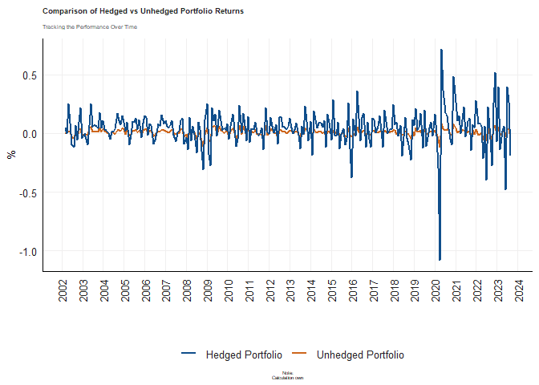

# Purpose

This is the final README, it is a compilation of questions one through
seven.

``` r
rm(list = ls()) # Clean your environment:
gc() # garbage collection - It can be useful to call gc after a large object has been removed, as this may prompt R to return memory to the operating system.
```

    ##          used (Mb) gc trigger (Mb) max used (Mb)
    ## Ncells 468272 25.1    1007727 53.9   660385 35.3
    ## Vcells 869517  6.7    8388608 64.0  1769630 13.6

``` r
library(tidyverse)
```

    ## ── Attaching core tidyverse packages ──────────────────────── tidyverse 2.0.0 ──
    ## ✔ dplyr     1.1.3     ✔ readr     2.1.4
    ## ✔ forcats   1.0.0     ✔ stringr   1.5.0
    ## ✔ ggplot2   3.4.4     ✔ tibble    3.2.1
    ## ✔ lubridate 1.9.3     ✔ tidyr     1.3.0
    ## ✔ purrr     1.0.2     
    ## ── Conflicts ────────────────────────────────────────── tidyverse_conflicts() ──
    ## ✖ dplyr::filter() masks stats::filter()
    ## ✖ dplyr::lag()    masks stats::lag()
    ## ℹ Use the conflicted package (<http://conflicted.r-lib.org/>) to force all conflicts to become errors

``` r
list.files('code/', full.names = T, recursive = T) %>% .[grepl('.R', .)] %>% as.list() %>% walk(~source(.))
```

``` r
#Loading all relevant packages. 
#install.packages("pacman")
pacman::p_load(tidyverse)
pacman::p_load(readxl)
pacman::p_load(readr)
pacman::p_load(ggplot2)
pacman::p_load(gt)
pacman::p_load(dplyr)
library(gt)
library(tidyverse)
library(dplyr)
```

``` r
#Loading all relevant code from each questions code folder. 
list.files('C:/Users/austi/OneDrive/Desktop/Masters/Financial Econometrics/22582053 (Fin_metrics)/Question 1/code', full.names = T, recursive = T) %>% as.list() %>% walk(~source(.))
list.files('C:/Users/austi/OneDrive/Desktop/Masters/Financial Econometrics/22582053 (Fin_metrics)/Question 2/code', full.names = T, recursive = T) %>% as.list() %>% walk(~source(.))
list.files('C:/Users/austi/OneDrive/Desktop/Masters/Financial Econometrics/22582053 (Fin_metrics)/Question 3/code', full.names = T, recursive = T) %>% as.list() %>% walk(~source(.))
list.files('C:/Users/austi/OneDrive/Desktop/Masters/Financial Econometrics/22582053 (Fin_metrics)/Question 4/code', full.names = T, recursive = T) %>% as.list() %>% walk(~source(.))
list.files('C:/Users/austi/OneDrive/Desktop/Masters/Financial Econometrics/22582053 (Fin_metrics)/Question 5/code', full.names = T, recursive = T) %>% as.list() %>% walk(~source(.))
list.files('C:/Users/austi/OneDrive/Desktop/Masters/Financial Econometrics/22582053 (Fin_metrics)/Question 6/code', full.names = T, recursive = T) %>% as.list() %>% walk(~source(.))
list.files('C:/Users/austi/OneDrive/Desktop/Masters/Financial Econometrics/22582053 (Fin_metrics)/Question 7/code', full.names = T, recursive = T) %>% as.list() %>% walk(~source(.))
```

# Question 1: Systematic AI fund

``` r
#Loading relevant data for question 1
library(tidyverse)
ASISA <- readRDS("C:/Users/austi/OneDrive/Desktop/Masters/Financial Econometrics/22582053 (Fin_metrics)/data/ASISA_Rets.rds") #The ASISA fund data starts on 2003-10-31 and ends 2023-09-30

BM <- readRDS("C:/Users/austi/OneDrive/Desktop/Masters/Financial Econometrics/22582053 (Fin_metrics)/data/Capped_SWIX.rds")#The BM data starts on 2002-02-28 and ends 2023-09-30

AI_Fund <- readRDS("C:/Users/austi/OneDrive/Desktop/Masters/Financial Econometrics/22582053 (Fin_metrics)/data/AI_Max_Fund.rds")#The AI_Fund data starts on 2003-01-31 and ends 2023-09-30 

#All the data ends on the same date but starts on different dates. I need to keep this in mind find plotting comparative plots. 
```

## Rolling returns camparison

``` r
#First loading the relevant packages 
pacman::p_load("xts", "tidyverse", "tbl2xts", "PerformanceAnalytics", 
    "lubridate", "glue", "RcppRoll")

#Now I need to merge the ASISA, BM and AI_fund datasets to ensure comparative analysis is easier. 
library(tidyverse)
library(lubridate)

# Renaming columns for ease
names(AI_Fund)[2] <- "AI_Fund_Return"
names(BM)[3] <- "BM_Return"

# Merging AI Fund and Benchmark Data
combined_returns_data <- left_join(AI_Fund, BM, by = "date")

# Aggregate ASISA Data
ASISA_aggregated <- ASISA %>%
  group_by(date) %>%
  summarize(ASISA_Return = mean(Returns))

# Merge with ASISA Data
final_merged_returns_data <- left_join(combined_returns_data, ASISA_aggregated, by = "date")

# Checking the final merged data
head(final_merged_returns_data)
```

    ## # A tibble: 6 × 5
    ##   date       AI_Fund_Return Tickers BM_Return ASISA_Return
    ##   <date>              <dbl> <chr>       <dbl>        <dbl>
    ## 1 2003-01-31       -0.0275  J433    -0.0372             NA
    ## 2 2003-02-28       -0.0427  J433    -0.0455             NA
    ## 3 2003-03-31       -0.0945  J433    -0.0828             NA
    ## 4 2003-04-30       -0.00903 J433    -0.000818           NA
    ## 5 2003-05-31        0.131   J433     0.127              NA
    ## 6 2003-06-30        0.00995 J433    -0.00341            NA

``` r
#Now I can start calculating the rolling returns

library(tidyverse)
library(RcppRoll)
library(fmxdat)


# Prepare the data
Rolling_returns_plot_df <- final_merged_returns_data %>%
  mutate(Rolling_Return_AI_Fund = RcppRoll::roll_mean(AI_Fund_Return, 12, fill = NA, align = "right"),
         Rolling_Return_BM = RcppRoll::roll_mean(BM_Return, 12, fill = NA, align = "right"),
         Rolling_Return_ASISA = RcppRoll::roll_mean(ASISA_Return, 12, fill = NA, align = "right")) %>%
  group_by(date) %>% 
  filter(any(!is.na(Rolling_Return_AI_Fund) | !is.na(Rolling_Return_BM) | !is.na(Rolling_Return_ASISA)))

# Create the plot
Rolling_returns_plot <- Rolling_returns_plot_df %>%
  ggplot() +
  geom_line(aes(date, Rolling_Return_AI_Fund, color = "AI Fund"), alpha = 0.7, size = 1.25) +
  geom_line(aes(date, Rolling_Return_BM, color = "Benchmark"), alpha = 0.7, size = 1.25) +
  geom_line(aes(date, Rolling_Return_ASISA, color = "ASISA"), alpha = 0.7, size = 1.25) +
  labs(title = "Rolling Returns: AI Fund vs Benchmark vs ASISA", x = "", y = "Rolling Return", caption = "Note: Rolling returns calculated over 12 months.") +
  theme_fmx(title.size = ggpts(30), subtitle.size = ggpts(5), caption.size = ggpts(25), CustomCaption = T) +
  fmx_cols()
```

    ## Warning: Using `size` aesthetic for lines was deprecated in ggplot2 3.4.0.
    ## ℹ Please use `linewidth` instead.
    ## This warning is displayed once every 8 hours.
    ## Call `lifecycle::last_lifecycle_warnings()` to see where this warning was
    ## generated.

``` r
# Apply finplot
finplot(Rolling_returns_plot, x.date.dist = "1 year", x.date.type = "%Y", x.vert = T, y.pct = T, y.pct_acc = 1)
```

    ## Warning: Removed 9 rows containing missing values (`geom_line()`).

 \##
Making use of the PerformanceAnalytics package to do inference on the
ASISA, BM and AI_Fund

``` r
library(tbl2xts)
library(tidyverse)
library(tidyr)
library(dplyr)
library(PerformanceAnalytics)

#Dropping the Tickets column from the dataset

final_merged_returns_data <- select(final_merged_returns_data, -Tickers)

#Transforming to xts

xts_final_merged_returns_data <-final_merged_returns_data %>% 
    gather(funds, returns, -date) %>% 
    group_by(funds) %>% 
    tbl_xts(tblData = ., cols_to_xts = returns, spread_by = funds)
```

### Some intresting stats

``` r
#Now that the merged returns data is in xts I can do some nice analysis 

#Calculate annualized returns for each dataset
ai_fund_stats <- table.AnnualizedReturns(xts_final_merged_returns_data$AI_Fund_Return, scale = 252)
bm_stats <- table.AnnualizedReturns(xts_final_merged_returns_data$BM_Return, scale = 252)
asisa_stats <- table.AnnualizedReturns(xts_final_merged_returns_data$ASISA_Return, scale = 252)
```

My fund = My fund has a very high annual return of 21% which is higher
than both the benchmark capped SWIX and the actively managed ASISA. My
fund also has an extremely low standard deviation of 0.726% which means
that my fund holds very little risk. Furthermore, the Sharpe ratio of
28.9 is extraordinarily high.

The benchmark fund = The benchmark fund has very decent annual returns
of 14.43%. Furthermore the benchmark as expected has a low annualized
standard deviation of 0.69%. Thus, meaning the benchmark holds very
little risk. Once again, the Sharpe ration of 19.52 is extraordinarily
high.

The active managers = The actice managers have on average an annualized
return of 8.1%, this is fairly good but is lagging behind my fund at 21%
and the benchmark at 14.43%.

### Some more intresting stats

``` r
AI_Fund_all_stats <- table.DownsideRisk(xts_final_merged_returns_data$AI_Fund_Return)
BM_all_stats <- table.DownsideRisk(xts_final_merged_returns_data$BM_Return)
ASISA_all_stats <- table.DownsideRisk(xts_final_merged_returns_data$ASISA_Return)
```

### Some histogram plots

``` r
# Add normal line and VaR estimates
AI_Fund_histogram <- chart.Histogram(xts_final_merged_returns_data$AI_Fund_Return, 
  methods = c("add.density", "add.normal", "add.risk"),
  main = "Adding Value at Risk (95%)")
```


``` r
BM_histogram <- chart.Histogram(xts_final_merged_returns_data$BM_Return, 
  methods = c("add.density", "add.normal", "add.risk"),
  main = "Adding Value at Risk (95%)")
```


``` r
ASISA_histogram <- chart.Histogram(xts_final_merged_returns_data$ASISA_Return, 
  methods = c("add.density", "add.normal", "add.risk"),
  main = "Adding Value at Risk (95%)")
```


### Lets now look at a plot that looks at the drawdowns present in each fund, which will evaluate the risk involved in each.

``` r
AI_Fund_Drawdowns <- chart.Drawdown(xts_final_merged_returns_data$AI_Fund_Return,main = "Drawdowns: AI_Fund", 
               col = "steelblue")

BM_Drawdowns <- chart.Drawdown(xts_final_merged_returns_data$BM_Return,main = "Drawdowns: Benchmark", 
               col = "steelblue")

ASISA_Drawdowns <- chart.Drawdown(xts_final_merged_returns_data$ASISA_Return,main = "Drawdowns: ASISA", 
               col = "steelblue")
```

AS can be seen from the above drawdowns plots, my AI_Fund and the
benchmark follows a very similar risk to drawdowns. On the contrary
ASISA (Which pertains to the active managers) contains heavier
drawdowns. Thus the active managers contains higher risk than that of
the benchmark fund (The market) and my fund

# Question 2

# Question 3: Portfolio construction

## Loading relevant data and packages

``` r
#Relevant data
ALSI <- readRDS("C:/Users/austi/OneDrive/Desktop/Masters/Financial Econometrics/22582053 (Fin_metrics)/data/ALSI.rds")

Rebalance_days <- readRDS("C:/Users/austi/OneDrive/Desktop/Masters/Financial Econometrics/22582053 (Fin_metrics)/data/Rebalance_days.rds")

#relevant packages
library(rmsfuns)
pacman::p_load("tidyr", "tbl2xts","devtools","lubridate", "readr", "PerformanceAnalytics", "ggplot2", "dplyr")
```

## Lets create an ALSI and SWIX weighted poerfolio cumulative returns

### First lets calculate each indexes weighted daily portfolio returns usinf the safe_returns:

``` r
#Transforming the data to xts format so we can use safe_returns
ALSI_weights_xts <- ALSI %>% 
    select(date, Tickers, J203) %>% 
    tbl_xts(cols_to_xts = J203, spread_by = Tickers)

SWIX_weights_xts <- ALSI %>% 
    select(date, Tickers, J403) %>% 
    tbl_xts(cols_to_xts = J403, spread_by = Tickers)

Returns_xts <- ALSI %>% 
    select(date, Tickers, Return) %>% 
    tbl_xts(cols_to_xts = Return, spread_by = Tickers)

#Making sure that all NA's are set to 0 

ALSI_weights_xts[is.na(ALSI_weights_xts)] <- 0
SWIX_weights_xts[is.na(SWIX_weights_xts)] <- 0
Returns_xts[is.na(Returns_xts)] <- 0

#Now using the safe returns I calculate the weighted portfolio returns for the ALSI. 
ALSI_port_returns <- rmsfuns::Safe_Return.portfolio(R = Returns_xts, weights = ALSI_weights_xts, lag_weights = T) %>%  
    xts_tbl() %>%  rename(ALSI_port_returns = portfolio.returns)
```

    ## Warning in Return.portfolio.geometric(R = R, weights = weights, wealth.index =
    ## wealth.index, : The weights for one or more periods do not sum up to 1:
    ## assuming a return of 0 for the residual weights

``` r
#Now using the safe returns I calculate the weighted portfolio returns for the SWIX.
SWIX_port_returns <- rmsfuns::Safe_Return.portfolio(R = Returns_xts, weights = SWIX_weights_xts, lag_weights = T) %>%  
    xts_tbl() %>%  rename(SWIX_port_returns = portfolio.returns)
```

    ## Warning in Return.portfolio.geometric(R = R, weights = weights, wealth.index =
    ## wealth.index, : The weights for one or more periods do not sum up to 1:
    ## assuming a return of 0 for the residual weights

``` r
#Merging the ALSI and SWIX weighted portfolio returns
returns_port_merged <- left_join(ALSI_port_returns, SWIX_port_returns, by= "date")

#Now i need to calculate the cumulative returns 

cumulative_returns_port <- returns_port_merged %>%  arrange(date) %>% 
    
    mutate(across(.cols = -date, .fns = ~cumprod(1 + .))) %>% 
    
    mutate(across(.cols = -date, .fns = ~./first(.))) %>% 
    # Start at 1
    
    pivot_longer(cols=-date, names_to = "Index", values_to = "Cummulative_port_returns")

#Now I am able to plot the cumulative portfolio returns of the ALSI and SWIX

cumulative_returns_port_plot <-    cumulative_returns_port %>%  
       
       ggplot() + 
  
  geom_line(aes(date, Cummulative_port_returns , color = Index), size = 0.5, alpha = 0.8) +
  
   fmxdat::theme_fmx(title.size = fmxdat::ggpts(25), 
                    subtitle.size = fmxdat::ggpts(0),
                    caption.size = fmxdat::ggpts(20),
                    CustomCaption = T) + 
    
  fmxdat::fmx_cols() + 
  
  labs(x = "", y = "Percentage(%)", caption = "Note:\nCalculation own",
       title = "Cumulative Returns of ALSI and SWIX Indexes",
       subtitle = "")

# Finplot for finishing touches:

fmxdat::finplot(cumulative_returns_port_plot, x.vert = T, x.date.type = "%Y", x.date.dist = "1 year")
```


As can be seen from the above graph, the cumulative returns for the ALSI
and the SWIX were very similar until 2020, at which point the ALSI began
outperforming the SWIX.

#### Each sectors weighted return contribution

``` r
portfolio_returns <- ALSI %>% 
    mutate(J203 = coalesce(J203,0)) %>% 
    mutate(J403 = coalesce(J403,0)) %>% 
    mutate(weighted_ALSI_ret = Return*J203) %>% 
    mutate(weighted_SWIX_ret = Return*J403)

portfolio_returns_with_total_sector_weights<-portfolio_returns %>% 
    arrange(date) %>% 
    group_by(date,Sector) %>% 
    mutate(ALSI_sector_weight = coalesce(J203,0)) %>% 
    mutate(SWIX_sector_weight = coalesce(J403,0)) %>% 
    mutate(ALSI_sector_returns = sum(weighted_ALSI_ret,na.rm = T)) %>% 
    mutate(total_ALSI_sector_weight = sum(J203, na.rm=T)) %>% 
    mutate(SWIX_sector_returns = sum(weighted_SWIX_ret, na.rm = T)) %>% 
    mutate(total_SWIX_sector_weight = sum(J403, na.rm=T)) %>% 
    ungroup()

#Transforming the sector weights data to xts to make use of the performance analytics package 
total_ALSI_sector_weight <-  portfolio_returns_with_total_sector_weights %>%  select(date, Sector ,total_ALSI_sector_weight) %>%  group_by(Sector) %>%  unique() %>%  
    tbl_xts(cols_to_xts = total_ALSI_sector_weight, spread_by = Sector)

total_SWIX_sector_weight <-  portfolio_returns_with_total_sector_weights %>%  select(date, Sector ,total_SWIX_sector_weight) %>%  group_by(Sector) %>%  unique() %>%  
    tbl_xts(cols_to_xts = total_SWIX_sector_weight, spread_by = Sector)

#Transforming the sectors returns to xts data so that we can make use of the performance analytics package
ALSI_sector_returns <- portfolio_returns_with_total_sector_weights %>%  select(date, Sector ,ALSI_sector_returns) %>%  group_by(Sector) %>%  unique() %>%  
    tbl_xts(cols_to_xts = ALSI_sector_returns, spread_by = Sector)

SWIX_sector_returns <- portfolio_returns_with_total_sector_weights %>%  select(date, Sector ,SWIX_sector_returns) %>%  group_by(Sector) %>%  unique() %>%  
    tbl_xts(cols_to_xts = SWIX_sector_returns, spread_by = Sector)

Fund_size_at_start <- 1000 #Setting the starting value for the portfolio 

ALSI_sector_return_division <- 
      rmsfuns::Safe_Return.portfolio(ALSI_sector_returns, 
                                     
                       weights = total_ALSI_sector_weight, lag_weights = TRUE,
                       
                       verbose = TRUE, contribution = TRUE, 
                       
                       value = Fund_size_at_start, geometric = TRUE) 
```

    ## Warning in Return.portfolio.geometric(R = R, weights = weights, wealth.index =
    ## wealth.index, : The weights for one or more periods do not sum up to 1:
    ## assuming a return of 0 for the residual weights

``` r
SWIX_sector_return_division <- 
      rmsfuns::Safe_Return.portfolio(SWIX_sector_returns, 
                                     
                       weights = total_SWIX_sector_weight, lag_weights = TRUE,
                       
                       verbose = TRUE, contribution = TRUE, 
                       
                       value = Fund_size_at_start, geometric = TRUE) 
```

    ## Warning in Return.portfolio.geometric(R = R, weights = weights, wealth.index =
    ## wealth.index, : The weights for one or more periods do not sum up to 1:
    ## assuming a return of 0 for the residual weights

#### The ALSI’s individual sectors weighted return contribution

``` r
#Lets now plot
 ALSI_sector_return_division$BOP.Weight  %>% .[endpoints(.,'months')] %>% chart.StackedBar()
```

 \####
The SWIX’s individual sectors weighted return contribution

``` r
#Lets now plot
 SWIX_sector_return_division$BOP.Weight  %>% .[endpoints(.,'months')] %>% chart.StackedBar()
```



## 5% capped portfolio

# Question 4

What is needed from me in this question: - Analyze if funds that have
performed well in the past will also perform well in the future. -
Evaluate whether funds that perform well in the past attract more
investors. - Evaluate whether investing in past good performers is a
good strategy.

## Loading the data and relevant packages

``` r
#Loading the data 
ASISA_Flows <- readRDS("C:/Users/austi/OneDrive/Desktop/Masters/Financial Econometrics/22582053 (Fin_metrics)/data/ASISA_Flows.rds")

ASISA_Rets <- readRDS("C:/Users/austi/OneDrive/Desktop/Masters/Financial Econometrics/22582053 (Fin_metrics)/data/ASISA_Rets.rds")

#Loading the relevant packages 
#install.packages("ggridges")
library(ggridges)
library(dplyr)
library(ggplot2)
library(tidyr)
library(lubridate)
library(knitr)
```

## Data preperation

``` r
# Merge the datasets
asisa_data <- left_join(ASISA_Flows, ASISA_Rets, by = c("date", "Fund", "Index", "FoF"))

# Ensure date columns are in Date format
asisa_data$date <- as.Date(asisa_data$date)

# Filter out Fund of Funds 
asisa_data <- filter(asisa_data, FoF == "No")
```

### Defining the look-back period and future performance periods

``` r
# Define look-back and future performance periods
look_back_years <- 3
future_performance_years <- 1

# Create year column for easier calculations
asisa_data <- asisa_data %>%
  mutate(year = year(date))
```

### Calculating cumulative returns for the look back period

``` r
# Calculate cumulative returns for each fund over the look-back period
cumulative_returns <- asisa_data %>%
  group_by(Fund) %>%
  filter(year >= max(year) - look_back_years) %>%
  summarize(cumulative_return = prod(1 + Returns) - 1) %>%
  ungroup()

# Rank funds based on these returns
cumulative_returns <- cumulative_returns %>%
  arrange(desc(cumulative_return)) %>%
  mutate(rank = row_number())
```

### Analyizing fund flows and future performance

``` r
# Merge the rankings back to the main data
asisa_data <- asisa_data %>%
  left_join(cumulative_returns, by = "Fund")

# Analyze fund flows for the year following the look-back period
fund_flows_analysis <- asisa_data %>%
  filter(year == max(year) - look_back_years + future_performance_years) %>%
  group_by(Fund) %>%
  summarize(total_flow = sum(Flows))

# Calculate future performance
future_performance <- asisa_data %>%
  filter(year >= max(year) - look_back_years + future_performance_years,
         year < max(year) - look_back_years + future_performance_years + future_performance_years) %>%
  group_by(Fund) %>%
  summarize(future_return = prod(1 + Returns) - 1) %>%
  ungroup()
```

### Analyizing data

``` r
# Combine flow analysis and future performance
combined_analysis <- fund_flows_analysis %>%
  left_join(future_performance, by = "Fund") %>%
  left_join(cumulative_returns, by = "Fund")
```

### Scatter plot illustrating the relationship between past performance and future performance

``` r
# Create a new variable for coloring
combined_analysis <- combined_analysis %>%
  mutate(intensity = cumulative_return + future_return)

# Plot with color 
ggplot(combined_analysis, aes(x = cumulative_return, y = future_return, color = intensity)) +
  geom_point() +
  scale_color_gradient(low = "blue", high = "red") +  # Adjust colors as needed
  labs(title = "Past vs Future Performance of Funds",
       x = "Past Cumulative Return",
       y = "Future Return",
       color = "Intensity") +
  theme_minimal() +
  theme(legend.position = "right")
```

    ## Warning: Removed 119 rows containing missing values (`geom_point()`).

 As can
be seen from the above graph, there does seem to be a positive
correlation between past cumulative returns and future performance.
However, not so straight forward, as there are some funds that had a
poor past cumulative return but had good future returns. Lets do some
further analysis.

### correlation analysis between cumulative past return(3 years) and total flow

``` r
# Calculate Pearson's correlation coefficient
correlation_result <- cor.test(combined_analysis$cumulative_return, combined_analysis$total_flow, method = "pearson")

# Print the results
correlation_result
```

    ## 
    ##  Pearson's product-moment correlation
    ## 
    ## data:  combined_analysis$cumulative_return and combined_analysis$total_flow
    ## t = 2.038, df = 849, p-value = 0.04186
    ## alternative hypothesis: true correlation is not equal to 0
    ## 95 percent confidence interval:
    ##  0.002581492 0.136338075
    ## sample estimates:
    ##        cor 
    ## 0.06977338

``` r
#Creating a nice table for the above results 
correlation_results_df <- data.frame(
  Statistic = c("Correlation Coefficient", "P-Value", "95% Confidence Interval Lower Bound", "95% Confidence Interval Upper Bound"),
  Value = c(0.06977338, 0.04186, 0.002581492, 0.136338075)
)


kable(correlation_results_df, 
      col.names = c("Statistic", "Value"), 
      caption = "Correlation Analysis Results", 
      align = 'c')
```

|              Statistic              |   Value   |
|:-----------------------------------:|:---------:|
|       Correlation Coefficient       | 0.0697734 |
|               P-Value               | 0.0418600 |
| 95% Confidence Interval Lower Bound | 0.0025815 |
| 95% Confidence Interval Upper Bound | 0.1363381 |

Correlation Analysis Results

### Lets create a linear regression to see if past performance does indicate future performance.

``` r
# Assuming combined_analysis has 'cumulative_return' for past performance
# and 'future_return' for future performance

# Linear Regression
model <- lm(future_return ~ cumulative_return, data = combined_analysis)

# Summary of the model
summary(model)
```

    ## 
    ## Call:
    ## lm(formula = future_return ~ cumulative_return, data = combined_analysis)
    ## 
    ## Residuals:
    ##      Min       1Q   Median       3Q      Max 
    ## -0.35143 -0.08688 -0.01069  0.05119  0.49152 
    ## 
    ## Coefficients:
    ##                   Estimate Std. Error t value Pr(>|t|)    
    ## (Intercept)       0.130772   0.006873   19.03   <2e-16 ***
    ## cumulative_return 0.195478   0.017903   10.92   <2e-16 ***
    ## ---
    ## Signif. codes:  0 '***' 0.001 '**' 0.01 '*' 0.05 '.' 0.1 ' ' 1
    ## 
    ## Residual standard error: 0.1103 on 849 degrees of freedom
    ##   (119 observations deleted due to missingness)
    ## Multiple R-squared:  0.1231, Adjusted R-squared:  0.1221 
    ## F-statistic: 119.2 on 1 and 849 DF,  p-value: < 2.2e-16

This regression analysis shows that there is a statistically significant
relationship between past return values and future return values. Thus
funds with higher past returns tend to have higher future returns.
However the R-squared value is fairly low at 0.12 which suggests that
past performance only explain 12% of the variation in future
performance. Thus although past performance does have a statistically
significant positive relationship with future performance, this
relationship is fairly week and should not be soley relied upon.

# Question 5

# Question 6
